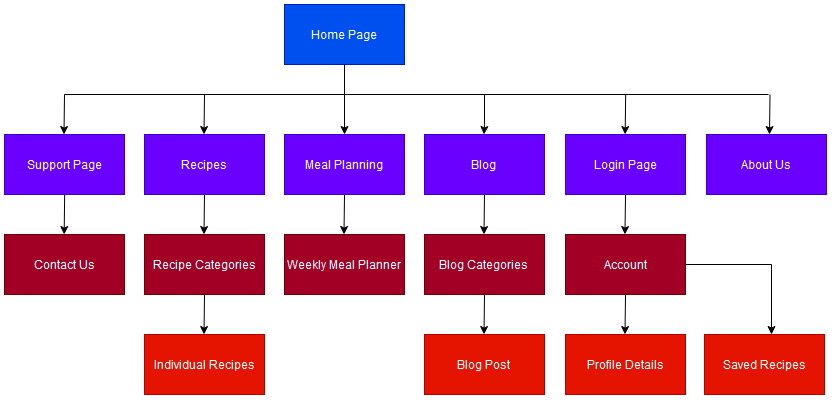

**PROMPT:**

I have to create user personas for my web app. The assignment involves creating user personas to represent target users, followed by the information architecture for my web app. You will organize content based on user needs to ensure easy navigation and a seamless user experience. I will need to also develop an information architecture for my project based on the card sorting method. My web app is going to be a web app for recipes called cooksy.

**RESPONSE:**

**Sample Personas for Cooksy**

**Persona 1:** Young Culinary Enthusiast

**Name:** Emily Chen**  
Age:** 24**Occupation:** Junior Graphic Designer  
**Tech Savvy Level:** High**Location:** Urban (Seattle, WA)

**Background**

Emily recently graduated from college and has a strong interest in healthy, affordable, and creative cooking. She loves experimenting in the kitchen, sharing her culinary adventures on social media, and trying new recipes. Emily often searches for recipes that fit her busy schedule and budget, and she values recipes that cater to her vegan lifestyle.

**Goals**

*   Find quick, affordable, and vegan-friendly recipes.
*   Share her creations with others and connect with like-minded cooking enthusiasts.
*   Save and organize her favorite recipes for easy access.

**Challenges**

*   Limited time and budget for cooking.
*   Needs clear instructions and visual aids to try new techniques.

**Motivations**

*   Personal growth and culinary experimentation.
*   Building her online presence and connecting with a community of food lovers.

**Preferred Features on Cooksy**

*   Recipe Filters: Easy-to-use filters for dietary preferences (e.g., vegan, gluten-free).
*   Step-by-Step Photos/Videos: Visual aids that make learning new recipes easy.
*   Community Interaction: Ability to comment, like, and share recipes and connect with others on the platform.

**Persona 2: Busy Parent**

**Name:** James Gonzalez**Age:** 38**Occupation:** Project Manager**Tech Savvy Level:** Medium**Location:** Suburban (Austin, TX)

**Background**

James is a father of two young kids and a project manager at a tech company. Between work, family time, and after-school activities, he has little time to plan meals. James prefers recipes that are quick, nutritious, and kid-friendly, and he often batch-cooks to simplify weekday dinners.

**Goals**

*   Find quick and easy recipes that appeal to his kids and fit his family’s dietary needs.
*   Save recipes in a way that is easy to access for weekly meal planning.
*   Share his family’s favorite recipes and connect with other parents for new ideas.

**Challenges**

*   Time constraints during weekdays.
*   Finding meals that are healthy but also appealing to picky eaters.

**Motivations**

*   Creating nutritious, affordable meals without spending too much time cooking.
*   Building a collection of go-to family recipes.

**Preferred Features on Cooksy**

*   Meal Planning Tools: Save recipes into custom categories for meal prep.
*   Family-Friendly Tags: Quick filtering for kid-approved and quick-cook recipes.
*   Batch-Cooking Tips: Techniques or suggestions for making larger portions.

**Persona 3:** Retired Food Lover

**Name:** Patricia King**Age:** 65**Occupation:** Retired Teacher**Tech Savvy Level:** Low-to-Medium**Location:** Rural (Vermont)

**Background**

Patricia recently retired and has developed a renewed interest in cooking. She enjoys trying traditional recipes and exploring new flavors. While she isn’t highly tech-savvy, Patricia is motivated to learn and share her culinary creations with friends and family. Her main focus is on finding recipes that are wholesome and easy to follow.

**Goals**

*   Find easy-to-follow, healthy recipes.
*   Save family recipes and create her own collection.
*   Explore new cuisines and traditional dishes from around the world.

**Challenges**

*   Needs clear, straightforward navigation.
*   Requires larger text or visual accessibility options.

**Motivations**

*   Enjoying cooking as a creative and relaxing activity.
*   Sharing and preserving her family recipes on a digital platform.

**Preferred Features on Cooksy**

*   User-Friendly Layout: Simple navigation and easy-to-read text.
*   Recipe Collections: Ability to create and save personal recipe collections.
*   Community Stories: Enjoys reading and sharing stories behind recipes, adding a personal touch.

**Information architecture:**

**1\. Home**

*   **Purpose:** Acts as the central hub and the main entry point where users can quickly access featured recipes, browse popular categories, and view new additions. It’s optimized for first-time and returning users to find content that might interest them right away.
*   **Content and Features:**
    *   **Hero Section:** Displays a featured recipe or seasonal theme.
    *   **Popular Categories:** Links to high-interest categories, such as "Quick Recipes" or "Healthy Eating."
    *   **New Additions:** A list of recently added recipes, updated daily or weekly.
    *   **Top Recipes:** A showcase of trending recipes based on user interactions, ratings, and seasonal relevance.

**2\. Recipes**

*   **Purpose:** This is the main repository of recipes, with multiple filtering options to help users find exactly what they need. Advanced search and sorting cater to different user preferences, from dietary restrictions to cooking time.
*   **Subsections:**
    *   **Filter By:**
        *   **Meal Type:** Categories like Breakfast, Lunch, Dinner, Snacks, and Desserts to help users quickly narrow down recipes based on meal time.
        *   **Dietary Needs:** Options include Vegan, Vegetarian, Gluten-Free, Keto, Paleo, Low-Carb. Allows users to filter out ingredients they cannot or do not wish to consume.
        *   **Cuisine:** Users can explore recipes based on cultural cuisines such as Italian, Mexican, Chinese, Indian, etc.
        *   **Cooking Time:** Options like "Under 15 mins," "15–30 mins," "30–60 mins," and "Over 60 mins," designed for users with time constraints.
    *   **Popular Recipes:**
        *   **Trending:** Highlights recipes that are currently trending.
        *   **Most Liked:** Based on user reviews and likes.
        *   **New Arrivals:** Lists the latest recipes added to the platform.

**3\. Meal Planning**

*   **Purpose:** Helps users plan their weekly meals in advance, including options for customized meal plans based on dietary needs. This section supports users looking for structured meal organization.
*   **Subsections:**
    *   **Weekly Planner:** A customizable meal plan calendar where users can add recipes for each day of the week, with options to adjust meals based on user dietary goals or family size.
    *   **Meal Prep Tips:** Tips for batch cooking, ingredient prepping, and efficient meal assembly to save time during the week.
    *   **Calorie Tracker (optional):** Allows users to track macros (calories, proteins, carbs, fats) for each meal, especially helpful for users with fitness or health goals.

**4\. Shopping List**

*   **Purpose:** Enables users to create and manage shopping lists based on selected recipes. This feature is designed for convenience, allowing users to easily collect and organize ingredients.
*   **Content and Features:**
    *   **Generate List**: Users can automatically generate a shopping list based on recipes added to their meal plan or favorites.
    *   **Customize List:** Users can add or remove items, adjust quantities, and categorize ingredients by store section (e.g., Produce, Dairy).
    *   **Print/Export Option:** Provides the option to print or export the list in PDF or mobile-friendly formats.

**5\. Account**

*   **Purpose:** A personalized section for users to manage their profile, save recipes, and set preferences. This section supports customization based on user needs and dietary restrictions.
*   **Subsections:**
    *   **Profile:** Includes user’s name, profile photo, bio, and general settings.
    *   **Saved Recipes:** Allows users to bookmark or favorite recipes, making it easier to return to frequently used or liked recipes.
    *   **Preferences:** Users can set dietary restrictions, allergy information, favorite cuisines, and saved search filters for a more tailored experience.

**6\. Blog**

*   **Purpose:** Provides food-related content beyond recipes, such as health tips, food trends, cooking advice, and expert recommendations. This section adds value for users interested in exploring more culinary knowledge.
*   **Subsections:**
    *   **Articles:** Features articles on cooking techniques, health advice, seasonal recipes, and food trends.
    *   **Trending Recipes:** Highlights current popular recipes with cultural or seasonal significance.
    *   **Expert Advice:** Articles and insights from chefs, nutritionists, and food bloggers on various topics like ingredient selection, cooking skills, and dietary advice.

**7\. Support**

*   **Purpose:** This section serves as a resource for users who need help with the platform or want to get in touch with Cooksy’s support team.
*   **Content and Features:**
    *   **FAQs:** A frequently asked questions section covering common topics like account setup, recipe saving, and troubleshooting.
    *   **Contact Us Form:** A form that allows users to send questions, feedback, or support requests directly to the Cooksy team.

**8\. Footer Links**

*   **Purpose:** Provides quick access to legal, informational, and social media links that are less critical to primary navigation but support the overall user journey.
*   **Content and Links:**
    *   **About Us:** A page detailing the mission and story of Cooksy.
    *   **Privacy Policy and Terms of Service:** Important legal documents regarding user data and website policies.
    *   **Social Media Links**: Links to Cooksy’s profiles on platforms like Facebook, Instagram, and Twitter for users who want to connect with Cooksy’s broader community.

**Site Map:**

